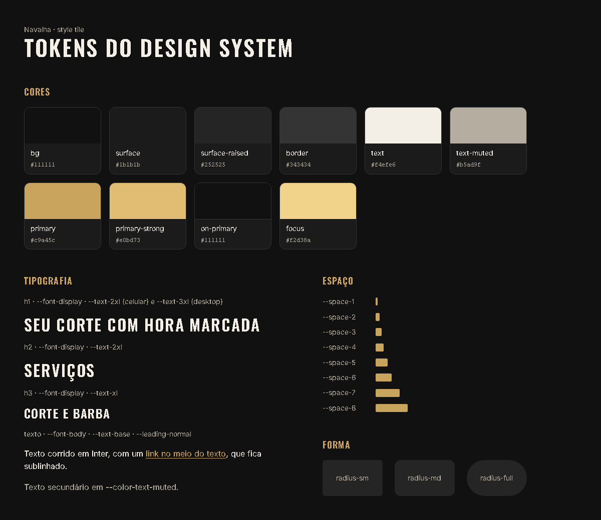

# T-004 · Base visual com os tokens

| Tipo | Tamanho | Marco | Depende de |
|---|---|---|---|
| feature | M (até 1h) | 1 · Site público | T-003 |

**Conceito novo:** cascata e herança; `var()` e `rem`.

## Contexto

A página já tem estrutura, mas está com a cara padrão do navegador: fundo branco e Times New Roman. Os tokens do design system já estão em `src/styles/tokens.css`. Seu trabalho é a base global: a cor da página, as fontes, os títulos, os links e o respiro das seções.

## Critérios de aceite

- [ ] Existe o `src/styles/base.css`, importado no `main.tsx` **depois** do `tokens.css`.
- [ ] **Dado** a página, **então** o `body` usa `--color-bg` no fundo, `--color-text` no texto, `--font-body`, `--text-base` e `--leading-normal`.
- [ ] **Dado** os títulos, **então**:
  - `h1`, `h2` e `h3` usam `--font-display`, peso 600, `--leading-tight`, `--tracking-wide` e caixa-alta;
  - `h1` e `h2` usam `--text-2xl`, e o `h3` usa `--text-xl`;
  - o `h2` tem `--space-5` de margem embaixo.
- [ ] **Dado** um link no meio de um texto, **então** ele usa `--color-primary` e continua sublinhado.
- [ ] **Dado** as seções, **então** toda `section` tem `padding` de `--space-7` em cima e embaixo e de `--space-4` dos lados.
- [ ] Não há nenhum valor solto, só tokens. A única exceção do projeto é a borda fina de 1px.
- [ ] A página passa no axe na regra de contraste.

## Layout

Para ver os títulos e o fundo no lugar, use a [pagina-375.png](../design/m1/pagina-375.png).

Medidas: estão todas nos critérios acima.

## Fora do escopo

- O estilo do cabeçalho, dos botões e dos cards, porque cada um tem o próprio ticket.
- Criar tokens novos.

## Guia rápido

- [Fundamentos de CSS › Como o CSS decide](../guias/css-fundamentos.md#como-o-css-decide)
- [Fundamentos de CSS › Herança](../guias/css-fundamentos.md#herança)
- [Fundamentos de CSS › Variáveis CSS](../guias/css-fundamentos.md#variáveis-css)
- [Fundamentos de CSS › Unidades](../guias/css-fundamentos.md#unidades)
- [Tokens do design system](../design/tokens.md)
- Oficial: [MDN · Cascata e herança](https://developer.mozilla.org/pt-BR/docs/Learn/CSS/Building_blocks/Cascade_and_inheritance)

## Como conferir

`npm run check` · `npm run e2e -- T-004` · `/revisar`
