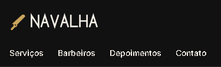

# T-005 · Cabeçalho no celular

| Tipo | Tamanho | Marco | Depende de |
|---|---|---|---|
| feature | M (até 1h) | 1 · Site público | T-004 |

**Conceito novo:** box model; CSS Modules.

## Contexto

Hoje o menu é uma lista vertical com bolinhas. O layout pede o cabeçalho em duas linhas: o logo em cima e os 4 links lado a lado embaixo, com uma área de toque confortável para o dedo.

É também o primeiro componente com estilo próprio, então ele inaugura a convenção do projeto: cada componente tem o seu `.module.css`.

## Critérios de aceite

- [ ] O cabeçalho vira o componente `Header`, em `src/site/Header.tsx`, com os estilos em `src/site/Header.module.css`. O `App.tsx` passa a usar `<Header />`.
- [ ] **Dado** o celular (375px), **então** o cabeçalho tem duas linhas: o logo e, embaixo, os 4 links lado a lado, sem as bolinhas da lista.
- [ ] **Dado** qualquer largura, **então** os 4 links ficam na mesma linha, e cada um tem área de toque de pelo menos 44px de altura, com `padding-block: var(--space-3)`. Atenção: num `<a>` inline, o padding vertical pinta o fundo, mas não ocupa espaço na linha, então o link precisa deixar de ser inline.
- [ ] **Dado** o logo, **então** ele tem `--space-6` de altura.
- [ ] **Dado** os links, **então** eles usam `--color-text`, `--text-sm` e peso 500, sem sublinhado, e ficam `--color-primary` com o mouse em cima.
- [ ] **Dado** o cabeçalho, **então** ele tem fundo `--color-bg` e uma borda de 1px `--color-border` embaixo.
- [ ] O cabeçalho passa no axe, no celular e no desktop.

## Layout

Medidas:
- o cabeçalho tem `padding: var(--space-3) var(--space-4) 0`;
- o logo tem `padding-block: var(--space-2)`;
- há `--space-5` entre um link e o seguinte.

## Fora do escopo

- O menu que abre e fecha no celular (T-013).
- O logo e os links na mesma linha no desktop (T-012).
- O cabeçalho fixo ao rolar a página (T-011).

## Guia rápido

- [Box model › As quatro caixas](../guias/box-model.md#as-quatro-caixas)
- [Box model › Display](../guias/box-model.md#display)
- [Box model › Margin padding e gap](../guias/box-model.md#margin-padding-e-gap)
- [CSS Modules › Como usar](../guias/css-modules.md#como-usar)
- Oficial: [MDN · O modelo de caixa](https://developer.mozilla.org/pt-BR/docs/Learn/CSS/Building_blocks/The_box_model)

## Como conferir

`npm run check` · `npm run e2e -- T-005` · `/revisar`
