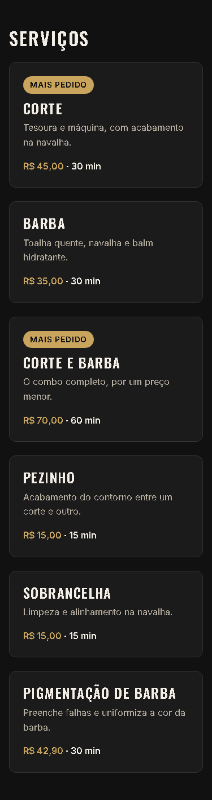

# T-007 · Card de serviço

| Tipo | Tamanho | Marco | Depende de |
|---|---|---|---|
| feature | M (até 1h) | 1 · Site público | T-006 |

**Conceito novo:** `Intl.NumberFormat`; renderização condicional.

## Contexto

A lista de serviços é o que o cliente mais consulta. Cada serviço vira um card com nome, descrição, preço em reais e duração, e os mais pedidos ganham um selo. Os dados já estão em `src/data/services.ts`: não escreva nenhum serviço à mão.

## Critérios de aceite

- [ ] Existe `formatCurrency(value: number): string` em `src/lib/format.ts`, usando `Intl.NumberFormat("pt-BR", { style: "currency", currency: "BRL" })`.
- [ ] A seção vira o componente `Services`, em `src/site/Services.tsx`. Ele faz o `map` de `services` para `<li><ServiceCard service={…} /></li>` dentro de uma `ul` sem bolinhas. O card é o componente `ServiceCard`, em `src/site/ServiceCard.tsx` com o seu `.module.css`, e tem as props tipadas.
- [ ] **Dado** cada serviço, **então** o card é um `article` com:
  - o nome num `h3`;
  - a descrição;
  - o preço formatado, por exemplo **R$ 45,00**;
  - a duração, por exemplo **30 min**.
- [ ] **Dado** um serviço com `popular: true`, **então** o card mostra o selo **Mais pedido** acima do nome. Nos outros cards, nada aparece no lugar do selo.
- [ ] **Dado** o card, **então**:
  - ele tem fundo `--color-surface`, borda de 1px `--color-border`, `--radius-md` e `padding: var(--space-5)`;
  - a descrição usa `--color-text-muted`;
  - o preço usa `--color-primary`.
- [ ] A seção de serviços passa no axe.

## Layout

Medidas:
- o selo tem `padding: var(--space-1) var(--space-3)`, `--radius-full`, fundo `--color-primary`, texto `--color-on-primary`, `--text-sm`, peso 600 e caixa-alta, com `--space-3` de espaço abaixo;
- o nome tem `--space-2` de espaço abaixo, e a descrição, `--space-4`;
- os cards ficam a `--space-4` um do outro (a grade só vem no T-008).

## Fora do escopo

- A grade em colunas (T-008).
- Clicar no serviço para agendar (marco 2).

## Guia rápido

- [Estado e eventos › Renderização condicional](../guias/estado-e-eventos.md#renderização-condicional)
- [CSS Modules › Várias classes e estados](../guias/css-modules.md#várias-classes-e-estados)
- [HTML semântico › Listas](../guias/html-semantico.md#listas)
- Oficial: [MDN · Intl.NumberFormat](https://developer.mozilla.org/pt-BR/docs/Web/JavaScript/Reference/Global_Objects/Intl/NumberFormat)

## Como conferir

`npm run check` · `npm run e2e -- T-007` · `/revisar`
