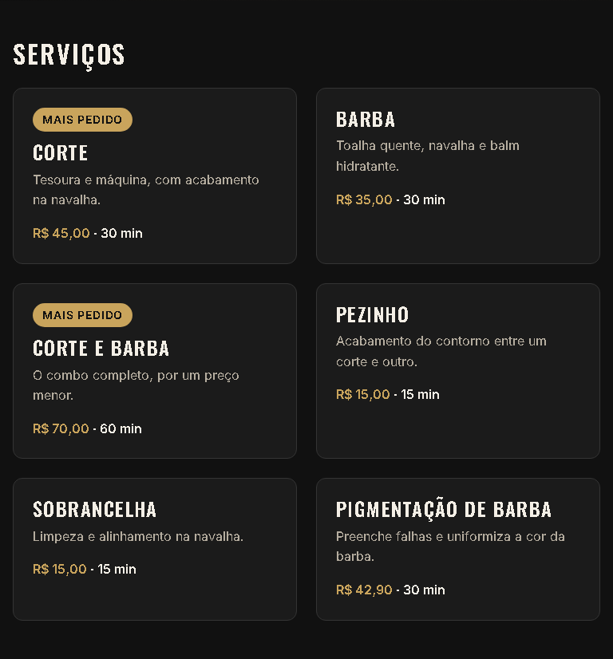

# T-008 · Grade de serviços

| Tipo | Tamanho | Marco | Depende de |
|---|---|---|---|
| feature | P (até 30 min) | 1 · Site público | T-007 |

**Conceito novo:** CSS Grid com `auto-fit` e `minmax`.

## Contexto

No celular, um card embaixo do outro funciona bem. No tablet e no desktop, sobra espaço. A grade precisa se ajeitar sozinha, sem media query: 1 coluna no celular, 2 no tablet e 3 no desktop.

## Critérios de aceite

- [ ] **Dado** a lista de serviços, **então** ela é uma grade que se ajusta sozinha, **sem nenhuma media query**, com cards de no mínimo `20rem` e `gap: var(--space-5)`. No celular, o card nunca pode ficar mais largo que a tela.
- [ ] **Dado** 375px, **então** a grade tem 1 coluna, e a página não rola na horizontal.
- [ ] **Dado** 768px, **então** a grade tem 2 colunas.
- [ ] **Dado** 1280px, **então** a grade tem 3 colunas.
- [ ] **Dado** cards de alturas diferentes na mesma linha, **então** todos ficam com a altura da linha.

## Layout

## Fora do escopo

- O container com largura máxima (T-012).

## Guia rápido

- [Grid › Colunas automáticas](../guias/grid.md#colunas-automáticas)
- [Grid › Grid ou flexbox](../guias/grid.md#grid-ou-flexbox)
- Oficial: [MDN · minmax()](https://developer.mozilla.org/en-US/docs/Web/CSS/Reference/Values/minmax) (em inglês; o MDN não tem esta página em português)

## Como conferir

`npm run check` · `npm run e2e -- T-008` · `/revisar`
