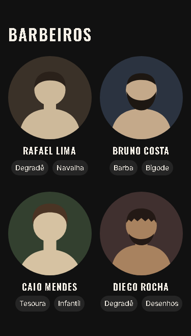

# T-009 · Barbeiros

| Tipo | Tamanho | Marco | Depende de |
|---|---|---|---|
| feature | M (até 1h) | 1 · Site público | T-008 |

**Conceito novo:** `object-fit` e `aspect-ratio`; flexbox com `flex-wrap`.

## Contexto

Cliente de barbearia escolhe pelo barbeiro. Cada um aparece com foto redonda, nome e especialidades em etiquetas. Atenção: a foto do Caio veio do fotógrafo num formato diferente das outras.

## Critérios de aceite

- [ ] Existem os componentes `Barbers` e `BarberCard`, em `src/site/`, usando os dados de `src/data/barbers.ts`.
- [ ] **Dado** cada barbeiro, **então** o card é um `article` com:
  - a foto, ``;
  - o nome num `h3`;
  - a lista de especialidades, com `aria-label="Especialidades"`.
- [ ] **Dado** 375px, **então** os cards ficam em 2 colunas, e todas as fotos são círculos perfeitos e do mesmo tamanho, sem achatar nenhuma, nem a do Caio.
- [ ] **Dado** as especialidades, **então** elas ficam lado a lado e centralizadas, numa lista flex com `flex-wrap: wrap` e `gap: var(--space-2)`, e passam para a linha de baixo se não couberem.
- [ ] **Dado** cada especialidade, **então** ela é uma etiqueta com `padding: var(--space-1) var(--space-2)`, `--radius-full`, fundo `--color-surface-raised` e `--text-sm`.
- [ ] A seção de barbeiros passa no axe.

## Layout

Medidas:
- a grade tem 2 colunas, com `gap: var(--space-6) var(--space-4)`;
- a foto tem `--space-3` de espaço abaixo;
- o nome usa `--text-lg`, com `--space-2` de espaço abaixo;
- o texto do card é centralizado.

## Fora do escopo

- As 4 colunas do desktop (T-012).
- Uma página para cada barbeiro.

## Guia rápido

- [Responsivo › Imagens fluidas](../guias/responsivo.md#imagens-fluidas)
- [Flexbox › Quebra de linha](../guias/flexbox.md#quebra-de-linha)
- [Flexbox › Alinhamento](../guias/flexbox.md#alinhamento)
- Oficial: [MDN · object-fit](https://developer.mozilla.org/pt-BR/docs/Web/CSS/object-fit)

## Como conferir

`npm run check` · `npm run e2e -- T-009` · `/revisar`
