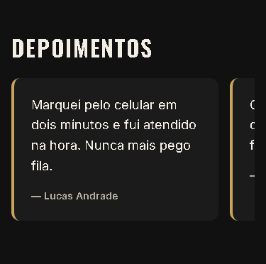

# T-010 · Depoimentos

| Tipo | Tamanho | Marco | Depende de |
|---|---|---|---|
| feature | P (até 30 min) | 1 · Site público | T-009 |

**Conceito novo:** `overflow`; `scroll-snap`.

## Contexto

Depoimentos convencem, mas cinco deles empilhados no celular viram um muro de texto. No celular, eles ficam numa faixa que rola para o lado e encaixa um depoimento por vez. A ponta do próximo aparece na borda, para o cliente perceber que dá para rolar.

## Critérios de aceite

- [ ] Existe o componente `Testimonials`, em `src/site/`, usando os dados de `src/data/testimonials.ts`.
- [ ] **Dado** cada depoimento, **então** ele é um `figure` com a citação num `blockquote` e o autor num `figcaption`, assim: **— Lucas Andrade**.
- [ ] **Dado** 375px, **então** a lista rola na horizontal (`overflow-x: auto`), encaixa em cada depoimento (`scroll-snap`), e cada item ocupa 85% da largura.
- [ ] **Dado** a página inteira, **então** ela continua sem rolagem horizontal. Só a faixa rola.
- [ ] **Dado** o teclado, **então** a faixa recebe foco para rolar com as setas: a `ul` tem `tabIndex={0}` e `aria-label="Lista de depoimentos"`.
- [ ] A seção de depoimentos passa no axe.

## Layout

Medidas:
- os itens ficam a `--space-4` um do outro, e a faixa tem `padding-bottom: var(--space-3)`;
- o card tem fundo `--color-surface`, `--radius-md`, `padding: var(--space-5)` e uma borda esquerda de `--space-1` em `--color-primary`;
- a citação usa `--text-lg`, com `--space-4` de espaço abaixo;
- o autor usa `--text-sm`, peso 600 e `--color-text-muted`.

## Fora do escopo

- A grade de 3 colunas do desktop (T-012).
- Setas ou bolinhas de navegação, que exigiriam um carrossel em JavaScript.

## Guia rápido

- [Responsivo › Rolagem horizontal](../guias/responsivo.md#rolagem-horizontal)
- [HTML semântico › Citações](../guias/html-semantico.md#citações)
- [Acessibilidade › Teclado e foco](../guias/acessibilidade.md#teclado-e-foco)
- Oficial: [MDN · scroll-snap-type](https://developer.mozilla.org/en-US/docs/Web/CSS/Reference/Properties/scroll-snap-type) (em inglês; o MDN não tem esta página em português)

## Como conferir

`npm run check` · `npm run e2e -- T-010` · `/revisar`
