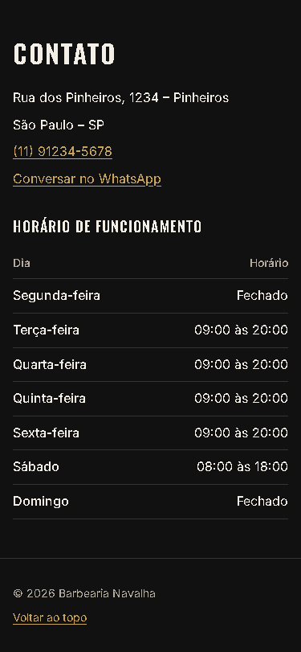

# T-011 · Contato, horário e rodapé

| Tipo | Tamanho | Marco | Depende de |
|---|---|---|---|
| feature | M (até 1h) | 1 · Site público | T-010 |

**Conceito novo:** tabela semântica; `position: sticky`.

## Contexto

Para fechar a página, faltam três informações: como chegar, como falar com a barbearia e quando ela abre. Também veio um pedido do PO: o menu precisa ficar sempre à mão, então o cabeçalho acompanha a rolagem.

## Critérios de aceite

- [ ] Existem os componentes `Contact` e `Footer`, em `src/site/`, usando os dados de `src/data/business.ts`.
- [ ] **Dado** o contato, **então** o endereço fica num `address`, sem itálico, com:
  - a rua e o bairro;
  - a cidade e o estado;
  - o telefone, como link `tel:` (**(11) 91234-5678**);
  - o link **Conversar no WhatsApp**.
- [ ] **Dado** o horário, **então** ele é uma `table` com:
  - a legenda (`caption`) **Horário de funcionamento**;
  - as colunas **Dia** e **Horário** num `thead`;
  - uma linha por dia, com o nome do dia num `th scope="row"`.
- [ ] **Dado** o rodapé, **então** ele mantém o © e ganha o link **Voltar ao topo**, para `#inicio`.
- [ ] **Dado** que rolo a página, **então** o cabeçalho fica grudado no topo (`position: sticky`), com fundo opaco e por cima do conteúdo (`z-index: 10`).
- [ ] **Dado** que clico num link do menu, **então** o título da seção não fica escondido atrás do cabeçalho: as seções com `id` têm `scroll-margin-top: var(--scroll-offset)`.
- [ ] O contato e o rodapé passam no axe.

## Layout

Medidas:
- o `address` tem `--space-6` de espaço abaixo e `--space-2` entre as linhas;
- a legenda da tabela usa `--font-display`, `--text-lg`, `--tracking-wide` e caixa-alta, alinhada à esquerda, com `--space-3` de espaço abaixo;
- as células têm `padding: var(--space-2) 0` e uma borda de 1px `--color-border` embaixo;
- os horários ficam alinhados à direita;
- o rodapé tem `padding: var(--space-6) var(--space-4)`, uma borda de 1px em cima, `--text-sm` e `--color-text-muted`, com `--space-2` entre o © e o link.

## Fora do escopo

- Mapa.
- Formulário de contato.
- O endereço e a tabela lado a lado (T-012).

## Guia rápido

- [HTML semântico › Tabelas](../guias/html-semantico.md#tabelas)
- [HTML semântico › Endereço e links especiais](../guias/html-semantico.md#endereço-e-links-especiais)
- [Posicionamento › Sticky](../guias/posicionamento.md#sticky)
- [Posicionamento › Âncoras e cabeçalho fixo](../guias/posicionamento.md#âncoras-e-cabeçalho-fixo)
- Oficial: [MDN · position](https://developer.mozilla.org/pt-BR/docs/Web/CSS/position)

## Como conferir

`npm run check` · `npm run e2e -- T-011` · `/revisar`
