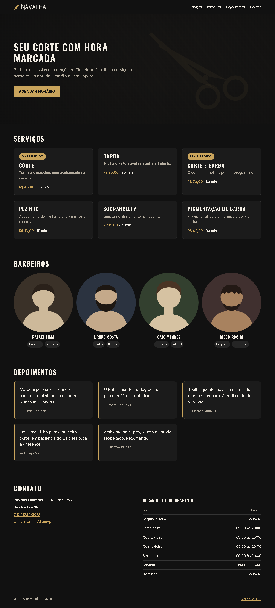

# T-012 · Versão desktop

| Tipo | Tamanho | Marco | Depende de |
|---|---|---|---|
| feature | M (até 1h) | 1 · Site público | T-011 |

**Conceito novo:** media queries com `min-width`; container.

## Contexto

Até aqui, tudo foi feito para o celular, de propósito: é o mobile-first. Agora o site precisa aproveitar as telas maiores sem quebrar o que já funciona. Compare com o layout do desktop.

## Critérios de aceite

- [ ] Existe a classe global `.container` no `base.css`, com `max-width: var(--container-max)` e `margin-inline: auto`. O conteúdo de cada seção, do cabeçalho e do rodapé fica dentro dela.
- [ ] **A partir de 640px:**
  - [ ] o cabeçalho fica numa linha só, com o logo à esquerda e os links à direita, alinhados pelo centro, e os links mantêm a área de toque de 44px;
  - [ ] as seções, o cabeçalho e o rodapé têm `padding-inline: var(--space-6)`;
  - [ ] os barbeiros ficam em 4 colunas;
  - [ ] o rodapé fica numa linha só, com o © à esquerda e o link à direita.
- [ ] **A partir de 1024px:**
  - [ ] os depoimentos viram uma grade de 3 colunas, sem rolagem;
  - [ ] o endereço e a tabela ficam lado a lado, em duas colunas com `gap: var(--space-7)`;
  - [ ] o hero ganha `padding-block` igual a duas vezes `--space-8`, o título passa a usar `--text-3xl`, e o texto fica com largura máxima de metade do container.
- [ ] **Dado** 375px e 1280px, **então** a página nunca rola na horizontal, e tudo o que já existia no celular continua igual.

## Layout

Os breakpoints são 640px e 1024px, como está em [tokens.md](../design/tokens.md#breakpoints). Escreva o número direto na `@media`, porque variável CSS não funciona ali.

## Fora do escopo

- O menu do celular (T-013).
- Tipografia fluida.

## Guia rápido

- [Responsivo › Mobile first](../guias/responsivo.md#mobile-first)
- [Responsivo › Media queries](../guias/responsivo.md#media-queries)
- [Responsivo › Container](../guias/responsivo.md#container)
- [Flexbox › Alinhamento](../guias/flexbox.md#alinhamento)
- Oficial: [MDN · Usando media queries](https://developer.mozilla.org/pt-BR/docs/Web/CSS/CSS_media_queries/Using_media_queries)

## Como conferir

`npm run check` · `npm run e2e -- T-012` · `/revisar`
