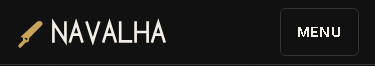
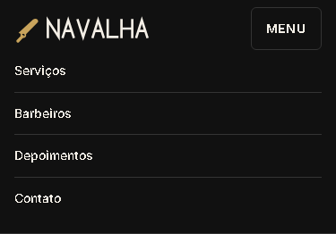

# T-013 · Menu do celular

| Tipo | Tamanho | Marco | Depende de |
|---|---|---|---|
| feature | M (até 1h) | 1 · Site público | T-012 |

**Conceito novo:** `useState` e `onClick`; `aria-expanded`.

## Contexto

O PO testou no celular: com o cabeçalho fixo, as duas linhas dele tomam espaço demais da tela. Abaixo de 640px, os links passam para um menu que abre e fecha num botão. É o primeiro estado do projeto.

## Critérios de aceite

- [ ] **Dado** menos de 640px, **então** o cabeçalho mostra, numa linha só, o logo à esquerda e um `button` **Menu** à direita, e os links ficam escondidos.
- [ ] **Dado** o botão, **quando** clico nele, **então** os links aparecem em coluna embaixo do logo. **Quando** clico de novo, eles somem. O estado aberto ou fechado fica num `useState` do `Header`.
- [ ] **Dado** o menu aberto, **quando** escolho um link, **então** a página vai para a seção, e o menu fecha.
- [ ] **Dado** o botão, **então**:
  - ele tem `aria-expanded` com o estado atual (`"true"` ou `"false"`) e `aria-controls="menu-principal"`;
  - o `nav` tem `id="menu-principal"`;
  - o texto do botão é sempre **Menu**.
- [ ] **Dado** o menu fechado, **então** o `nav` fica com `display: none`. É por isso que o Tab pula os links.
- [ ] **Dado** 640px ou mais, **então** o botão some, e os links aparecem como no T-012.

## Layout

Medidas:
- no celular, o cabeçalho tem `padding: var(--space-2) var(--space-4)`;
- o botão tem `padding: var(--space-3) var(--space-4)`, borda de 1px `--color-border`, `--radius-sm`, fundo transparente, texto `--color-text`, `--text-sm`, peso 600 e caixa-alta;
- no menu aberto, cada link ocupa a linha inteira, com uma borda de 1px `--color-border` entre um e outro.

## Fora do escopo

- Animação ao abrir.
- Fechar com Esc ou clicando fora.
- O ícone de hambúrguer.

## Guia rápido

- [Estado e eventos › Estado com useState](../guias/estado-e-eventos.md#estado-com-usestate)
- [Estado e eventos › Eventos](../guias/estado-e-eventos.md#eventos)
- [Acessibilidade › Botões que abrem e fecham](../guias/acessibilidade.md#botões-que-abrem-e-fecham)
- Oficial: [react.dev · useState](https://react.dev/reference/react/useState)

## Como conferir

`npm run check` · `npm run e2e -- T-013` · `/revisar`
