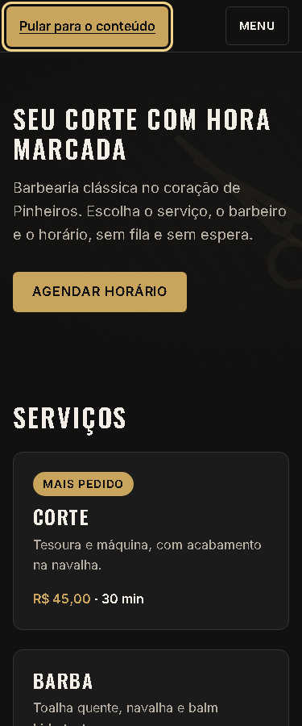

# T-014 · Acessibilidade e Lighthouse

| Tipo | Tamanho | Marco | Depende de |
|---|---|---|---|
| feature | M (até 1h) | 1 · Site público | T-013 |

**Conceito novo:** navegação por teclado (link de pular e foco visível); Lighthouse.

## Contexto

Antes de fechar o marco, o site precisa funcionar só com o teclado, que é como muita gente navega. Hoje o foco aparece de jeitos diferentes em cada lugar, e quem usa o teclado precisa passar pelo menu inteiro antes de chegar ao conteúdo.

## Critérios de aceite

- [ ] **Dado** a página, **quando** aperto Tab pela primeira vez, **então** aparece no topo o link **Pular para o conteúdo**, que leva para `#conteudo`. Antes de receber foco, ele fica fora da tela, escondido com `transform` (e não com `display: none`).
- [ ] **Dado** o link de pular, **quando** aperto Enter, **então** o próximo Tab vai direto para **Agendar horário**. Para isso, o `main` tem `id="conteudo"` e `tabIndex={-1}`, e não mostra contorno quando recebe foco.
- [ ] **Dado** qualquer elemento focável, **quando** navego com Tab, **então** ele mostra `outline: 3px solid var(--color-focus)` com `outline-offset: 3px`, vindo de uma regra global de `:focus-visible` no `base.css`.
- [ ] **Dado** o desktop, **então** a ordem do Tab é esta: Pular para o conteúdo → logo → Serviços → Barbeiros → Depoimentos → Contato → Agendar horário → Lista de depoimentos → telefone → Conversar no WhatsApp → Voltar ao topo.
- [ ] **Dado** a página inteira, **então** ela passa no axe no celular, com o menu fechado e com o menu aberto, e no desktop.
- [ ] **Dado** o Lighthouse no modo mobile, **então** a nota de Acessibilidade é 95 ou mais. Cole a nota na descrição do PR.

## Layout

Medidas do link de pular: `position: absolute`, `top` e `left` em `--space-2`, `padding: var(--space-3) var(--space-4)`, fundo `--color-primary`, texto `--color-on-primary`, `--radius-sm` e peso 600. Ele fica por cima do cabeçalho.

## Fora do escopo

- Testar com leitor de tela, como o NVDA (é um extra opcional).
- Modo de alto contraste.

## Guia rápido

- [Acessibilidade › Pular para o conteúdo](../guias/acessibilidade.md#pular-para-o-conteúdo)
- [Acessibilidade › Teclado e foco](../guias/acessibilidade.md#teclado-e-foco)
- [Acessibilidade › axe e Lighthouse](../guias/acessibilidade.md#axe-e-lighthouse)
- [DevTools › Lighthouse](../guias/devtools.md#lighthouse)
- Oficial: [web.dev · Foco](https://web.dev/learn/accessibility/focus)

## Como conferir

`npm run check` · `npm run e2e -- T-014` · Lighthouse · `/revisar`
