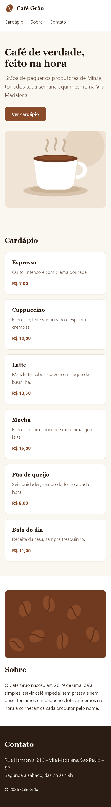

# T-015 · Desafio do marco 1

| Tipo | Tamanho | Marco | Depende de |
|---|---|---|---|
| desafio | 1h30, sem IA | 1 · Site público | T-014 |

**Conceito novo:** nenhum. É a prova do que você aprendeu no marco.

## Contexto

Fim do marco 1. Uma cafeteria pediu uma landing page, e você tem o tempo de uma etapa de entrevista para entregar. Este desafio é o termômetro honesto do que ficou na sua cabeça, e por isso é feito sem IA.

## Critérios de aceite

- [ ] O enunciado, as regras e os critérios de avaliação estão em [desafios/m1/README.md](../desafios/m1/README.md).
- [ ] Você trabalha por 1h30, com cronômetro e sem IA. No fim do tempo, faz o commit do que tiver na branch `feature/T-015-desafio-m1`.

## Layout

O layout do desktop está no README do desafio.

## Fora do escopo

- React, JavaScript e build. O desafio é só HTML e CSS.

## Guia rápido

Durante o desafio, os guias do marco 1 estão liberados. A IA não está.

## Como conferir

`/revisar` depois do commit.
