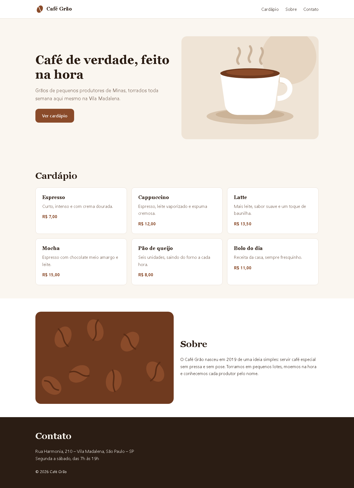

# Desafio do marco 1 · Café Grão

Uma cafeteria do bairro pediu a landing page dela. Você tem o layout e os textos, e o tempo de uma etapa de entrevista.

## Regras

- **Tempo: 1h30, cronometrada.** Quando o tempo acabar, pare e entregue o que tiver.
- **Sem IA.** Pode consultar o MDN, os guias do marco 1 (`guias/`) e o código que você mesmo escreveu no Navalha.
- **Só HTML e CSS.** Não tem React nem build: o projeto é um `index.html` e um `styles.css`.

## O que já vem pronto

| Arquivo | O que tem |
|---|---|
| `index.html` | só o `head`, com idioma, título, favicon e o link do CSS |
| `styles.css` | os tokens (cores, fontes, espaços) e um reset. Escreva abaixo da linha marcada |
| `dados.md` | todos os textos da página |
| `assets/` | o logo e as duas ilustrações |
| `../../design/desafio-m1/` | o layout em 375px e em 1280px |

## Como abrir

Dê dois cliques no `index.html`, ou rode na raiz do repositório:

```powershell
npx serve desafios/m1
```

## O layout




- A largura máxima do conteúdo é `--container-max` (68rem), centralizada.
- A partir de **768px**, o destaque e o "Sobre" ficam em duas colunas, e o cabeçalho fica numa linha só.
- Os cards do cardápio se reorganizam sozinhos: 1 coluna no celular e 3 no desktop.
- As medidas usam os tokens do `styles.css`. Não precisa acertar pixel por pixel: o que conta é a estrutura, a escala de espaços e o comportamento nas duas larguras.

## Entrega

1. Crie a branch `feature/T-015-desafio-m1`.
2. Ligue o cronômetro e faça.
3. Ao fim do tempo, faça o commit do que tiver (`feat(desafio): landing do Café Grão`) e rode o `/revisar`.

## Como o review avalia

| Critério | O que olha |
|---|---|
| Semântica | `header`, `nav`, `main`, `section` com títulos, `footer`; um único `h1`; `alt` nas imagens; o cardápio como lista |
| Fidelidade ao layout | a mesma estrutura, a mesma ordem e a escala de espaços dos tokens nas duas larguras |
| Responsividade | a página nunca rola na horizontal, em 375px nem em 1280px |
| Acessibilidade | contraste (os tokens já passam), foco visível no teclado e links com texto claro |
| Organização do CSS | só tokens, nenhum valor solto repetido, nomes de classe que dizem o que a coisa é |
